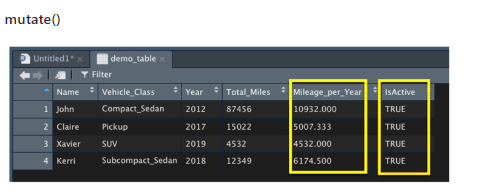
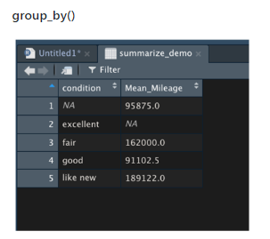
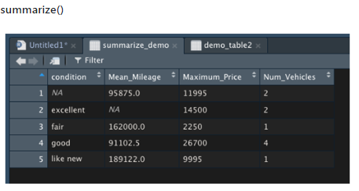
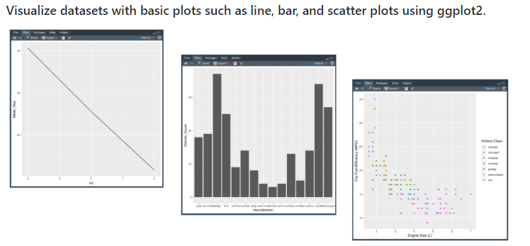
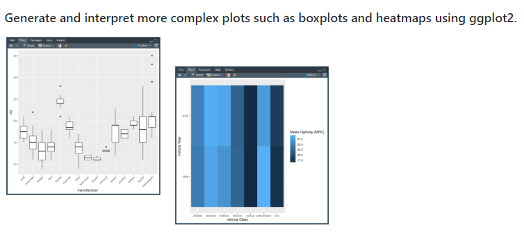

## DESCRIPTION
Applying our understanding of statistics and hypothesis testing to analyze a series of datasets from the automotive industry. 
The analysis includes visualizations, statistical tests, and interpretation of the results. All of our statistical analysis and visualizations are written in the R programming language.

This involves data extraction, transformation and loading (ETL), visualization of the data; and analyzing the data using R. 
Additionally, a variety of statistical tests, their real-world application in data science, and their implementation in R is explored.

### SITUATION/TASK
Load, clean up, and reshape datasets using tidyverse in R. Use some of the tidyverse package including dplyr, tidyr, and ggplot2, as these packages work together to help simplify the process. They help create transformed data columns, group data using factors, reshape two-dimensional data structures, and visualize results using plots.

### APPROACH
  * Load: 
  First, install the tidyverse in our R environment.  USE | install.packages("tidyverse").
  Usually when analyzing data, we want to perform calculations and incorporate the calculations back into the raw data to ease in     
  downstream analysis. Tidyverse’s dplyr library transforms R data. USE | library(tidyverse).
  
  * Clean Up:
  The dplyr library contains a wide variety of functions that can be chained together to transform data quickly and easily.
    * mutate() transforms a data frame and include new calculated data columns.
    
    
    * group_by() tells dplyr which factor (or list of factors in order) to group our data frame by. 
    
    
    * summarize() creates columns in our summary data frame and will use statistics summary functions such as mean(), median(),
      sd(), min(), max(), and n().
 
   

  * Reshape:
  The tidyr library from the tidyverse has the gather() and spread() functions to help reshape our data and redesign our dataframe to 
  a less complicated and more compatible versions.
    * gather() changes the dataset to a long format.
    * spread() spreads out a variable column of multiple measurements into columns for each variable.
 
 ### RESULTS
  * Visualization:
  
    
 
 
     
 
 
### THINGS LEARNED
* Load, clean up, and reshape datasets using tidyverse in R.
* Visualizing datasets with basic plots such as line, bar, and scatter plots using ggplot2.
* Generating and interpreting more complex plots such as boxplots and heatmaps using ggplot2.
* Ploting and identifying distribution characteristics of a given dataset.
* Formulating null and alternative hypothesis tests for a given data problem.
* Implementing and evaluating simple linear regression and multiple linear regression models for a given dataset.
* Implementing and evaluating the one-sample t-Tests, two-sample t-Tests, and analysis of variance (ANOVA) models for a given dataset.
* Implementing and evaluating a chi-squared test for a given dataset.
* Identifying key characteristics of A/B and A/A testing.
* Determining the most appropriate statistical test for a given hypothesis and dataset.

### SOFTWARE/TOOLS
 R, RStudio, Rtools
